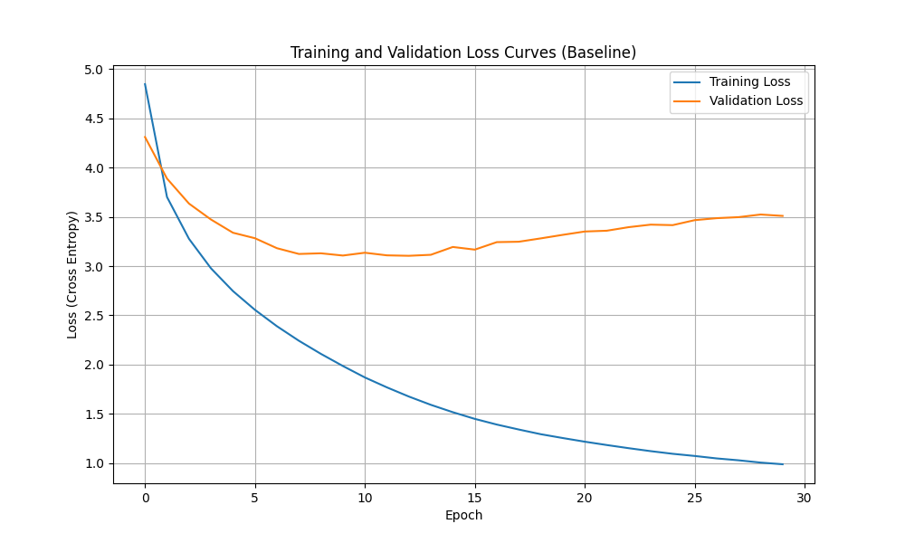
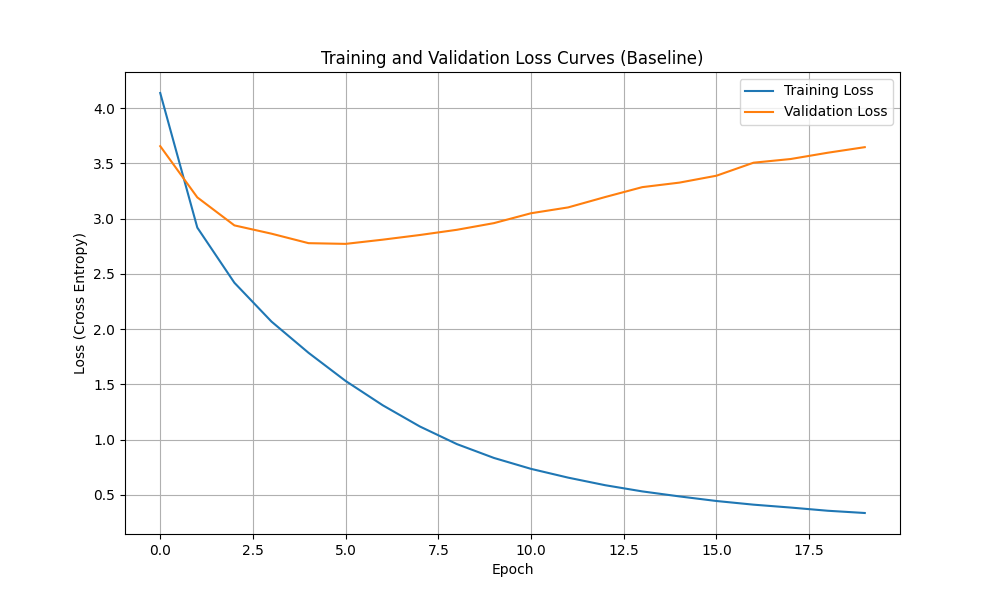
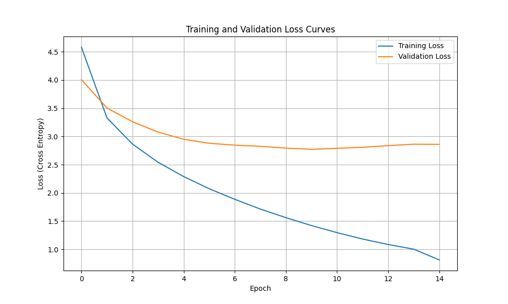

好的，没问题。

你希望我提供上一份 `README.md` 的完整 Markdown 原始代码，**并且移除 "参考文献" (References) 部分**。

这是你需要的、已修改的 Markdown 原始代码：

```markdown
# 从零实现 Transformer (Encoder-Decoder)

[](https://www.python.org/downloads/release/python-3100/)
[](https://pytorch.org/get-started/locally/)
[](https://opensource.org/licenses/MIT)

这是我的“大模型基础与应用”课程的中期作业。

本项目包含了一个完整的 **Encoder-Decoder Transformer** 模型的“从零开始”实现，严格遵循了 [1] Vaswani 等人在 2017 年的经典论文 **"Attention Is All You Need"** 中的架构。

该模型使用 PyTorch 框架搭建，并在 `bentrevett/multi30k` 数据集上训练，以完成一个**英-德机器翻译**任务。

---

## 核心特性

* **完整架构**: 实现了包括 `Encoder` 和 `Decoder` 在内的完整 Transformer 架构。
* **核心组件**: 从零开始构建了所有关键模块，包括：
    * `ScaledDotProductAttention` (缩放点积注意力)
    * `MultiHeadAttention` (多头注意力)
    * `PositionalEncoding` (正弦位置编码)
    * `PositionWiseFFN` (逐位置前馈网络)
    * `Masking` (填充掩码与前瞻掩码)
* **进阶训练**: 实现了作业“进阶”要求 中的所有训练稳定性技巧：
    * **`AdamW`** 优化器
    * **梯度裁剪 (Gradient Clipping)**
    * **`tqdm`** 进度条
    * **`ReduceLROnPlateau` 学习率调度器** (用于消融实验)
    * **模型保存/加载**
    * **训练/验证曲线可视化**
* **可复现性**: 项目包含了完整的复现脚本和详细的环境说明。

## 仓库结构

```

.
├── checkpoints/    \# (被 .gitignore 忽略) 存放训练好的 .pt 模型文件
├── data/           \# 包含数据样本和 README，用于说明数据格式
├── results/        \# 存放训练和验证损失曲线图
├── scripts/        \# 包含一键运行的 run.sh 脚本
├── src/            \# 包含所有的 Python 源代码
│   ├── model.py            \# (Transformer 架构)
│   ├── data\_loader.py    \# (PyTorch Dataset 和 DataLoader)
│   ├── build\_tokenizer.py  \# (训练 WordPiece 分词器)
│   ├── train.py            \# (主训练和评估循环, 包含优化)
│   ├── train\_baseline.py   \# (用于复现“基线”实验的脚本)
│   └── utils.py            \# (掩码创建函数)
├── .gitignore
├── requirements.txt  \# 所有的 Python 依赖
└── README.md         \# (本文档)

````
*(注：`train_ad.py` 和 `train.py` 对应你日志中的优化前和优化后脚本)*

---

## 环境设置与安装

本项目对硬件有特定要求，因为训练中使用了 PyTorch 的 Nightly (开发) 版本以兼容最新的 NVIDIA GPU。

### 1. 硬件要求

* **GPU**: NVIDIA GPU (本项目在 `NVIDIA GeForce RTX 5070 Ti` 上开发测试)
* **CUDA 架构**: 需要支持 `sm_120` 或更高版本。

### 2. 环境与依赖

本项目使用 Conda 管理环境，并指定 `python=3.10`。

**克隆仓库:**
```bash
git clone [https://github.com/linyuan-s/from-zero-to-transformer.git](https://github.com/linyuan-s/from-zero-to-transformer.git)
cd from-zero-to-transformer
````

**创建并激活 Conda 环境:**

```bash
conda create -n transformer python=3.10
conda activate transformer
```

**安装所有依赖 (包括 PyTorch Nightly):**

```bash
# 警告：此命令会安装一个非常大的、为 CUDA 12.8 编译的 PyTorch Nightly 版
# 请确保你的网络连接稳定
pip install -r requirements.txt
```

## 如何运行

本项目提供了一个 `run.sh` 脚本，可以一键完成所有步骤（分词器训练 -\> 模型训练）。

### 1\. (推荐) 一键运行 (训练优化后的模型)

```bash
bash scripts/run.sh
```

*(注: `run.sh` 默认运行 `src/train.py`，即优化后的版本)*

### 2\. (手动) 分步运行

如果你想手动执行每个步骤：

**第一步: 训练分词器**
(此步骤会读取 `multi30k` 数据集并创建 `tokenizers/` 文件夹)

```bash
python src/build_tokenizer.py
```

**第二步: 开始训练 (baseline)**
(此步骤会运行带学习率调度器的训练)

```bash
python src/train.py
```

**(复现) 运行NO_PE模型 (用于消融实验)**

```bash
python src/train_ad.py --no-pe
```
**(复现) 运行优化模型**

```bash
python src/train_ad.py
```

## 实验结果与分析

我进行了三组实验，以验证模型各个组件的有效性，并展示了为解决过拟合问题所做的优化。

| 实验 | 最佳验证损失 | 最佳验证 PPL | 观察 |
| :--- | :---: | :---: | :--- |
| **A: 消融实验 (无位置编码)** | \~3.1 | \~22.2 | 性能差，证明了 PE 的必要性 |
| **B: 基线模型 (有 PE)** | 2.772 | 15.987 | 性能中等，但严重过拟合 |
| **C: 优化模型 (有 PE + 调度器)** | 2.769 | 15.941 | 性能最佳，过拟合被抑制 |

### 1\. 实验 A: 消融实验 (移除位置编码)

  * **描述**: 为了验证位置编码 (Positional Encoding) 的重要性，我进行了一组消融实验，将其从模型中移除。
  * **发现**: 如图所示，训练损失仍然下降，但验证损失明显高于其他实验 (最佳约 3.1，对应PPL \~22.2)。这证明了 Transformer 模型在没有位置信息时，学习翻译任务的能力严重受限。



### 2\. 实验 B: 基线模型 (有位置编码, 无调度器)

  * **描述**: 这是我们的基线模型，它包含了所有核心组件，但使用固定的 `3e-4` 学习率。
  * **发现**: 模型学习有效，在 Epoch 06 验证 PPL 达到了最低点 **15.987** (损失 2.772)。在此之后，如图所示，训练损失继续下降，而验证损失迅速反弹，显示出在小数据集上的严重过拟合。



### 3\. 实验 C: 优化模型 (有位置编码 + 学习率调度器)

  * **描述**: 为解决实验 B 中的过拟合问题，我们引入了作业“进阶”要求中的 `ReduceLROnPlateau` 学习率调度器。
  * **发现**: 优化取得了成功。
      * 模型的最佳 PPL 被进一步降低至 **15.941** (损失 2.769)，在 Epoch 09 达到。
      * 更重要的是，如图所示，在模型过拟合后，调度器成功抑制了验证损失的剧烈反弹，使其趋于稳定（收敛在 2.8 左右），而不是像基线模型那样持续恶化。


